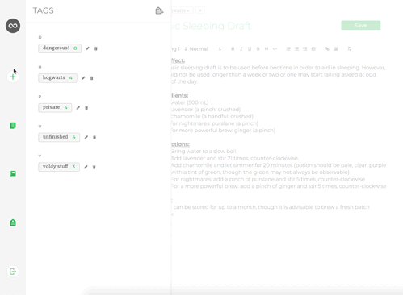

# Infinotes

[Live Demo][heroku]


[heroku]: https://infinotes.herokuapp.com/
Infinotes is a note-taking website to help you stay organized, inspired by Evernote. It uses Rails/PostgreSQL for the backend and React.js and Redux for the frontend. It also utilizes Animate.css and Quill libraries.

This project was designed and built in 10 days, with additional features forthcoming.

## Current Features
  * Secure frontend to backend user authentication using BCrypt.
  * Users can create and edit notes using a Quill-enabled rich text editor.
  * Notes filter based on tag or notebook chosen
  * Users can add, remove, and edit tags, as well as assign and unassign them to notes.
  * Users can add, remove, and edit notebooks, and choose a notebook on note creation. 
  * Notes support images and animated GIFs.

### Filtering Notes

The collection of notes that is always available is based on whether a current filter is applied or not. When unapplied, a user is able to see all their notes, sorted by most recently edited. From the side panel, they can choose to see a list of all tags, or all notebooks, and upon choose, then filter is applied.


This was done by creating a handleFilter on click event (for both notebooks and tags) that passes in which filter to apply, as well as a payload. Once the promise is returned, it closes that respective panel. All of this is handled with a ui reducer.

```js
  // Upon notebook click, pass in that entire notebook.
  // Receive all notes that match that notebook id.
  // Add that filter to the ui and remove the panel from the ui
  handleFilter(notebook) {
    this.props.getNotebookNotes(notebook.id)
      .then(() => this.props.addFilter("notebook", notebook))
      .then(() => this.props.closePanelModal("notebook"));
  }
```

### Tagging assignment

Users can add tags to an existing note, remove them from the note, as well as edit the tag itself or delete it completely. 


Tagging should be something that users don't have to think about at all. The code to require little thought isn't too complex at first, but becomes more so when you want users to be able to seamlessly add more.

```js
  // The value passed in is first checked against all tags to 
  // see if it exists, if it does, tagId is assigned.

  // If it is assigned, create that association between the 
  // note and the tag, then reset the state for additional tagging.
  
  // If the tag doesn't exist (tagId isn't assigned), first, 
  // create that tag, then use the note id that returns from the
  // promise as the note_id in the tagging relationship. 
  // Again, resetting the state.

  if (tagId) {
      this.props.createTagging({ tag_id: tagId, note_id: noteId })
      .then(() => this.setState({ note: this.state.note, changes: false, tag: '' }));
    } else {
      this.props.createTag({ name: this.state.tag })
      .then((res) => (
      this.props.createTagging({ tag_id: res.tag.id, note_id: noteId })
      .then(() => this.setState({ note: this.state.note, changes: false, tag: '' }))
      )     
      );
    }
```

### Creating and updating notes



Notes are added to the screen immediately upon creation. Leveraging React and Redux, once the user submits their note, every other element that is subscribed to that change is updated.

Notes are also sorted by most recently updated, which is calculated in the container and passed in to the index:

```javascript
  // notes are passed up from the backend with a current updated
  // at timestamp.

  const mapStateToProps = (state, ownProps) => ({
    notes: Object.values(state.entities.notes).sort((note1, note2) => Date.parse(note1.updated_at) < Date.parse(note2.updated_at)),
    filter: state.ui.filter,
    payload: state.ui.payload
});
```

In the above example, the new note modal is opened on top of the tags modal, preserving the option for the user to interact with it as well, if they so choose.

```javascript
  // The event listener is added to close the modal, but only
  // after fadeOut has finished (otherwise it's a little jarring.

  handleClose(type) {
    let modal = document.getElementById('note-modal');
    modal.classList.add('fadeOut');
    modal.classList.remove('fadeIn');
    this.resetForm();
    modal.addEventListener('animationend', () => this.props.closeModal(type));
  }
```

This code can also be lightly modified and reused for other, similar modals that apply to this type of application.

## Project Design

Infinotes was designed to be simple and light, with critical features in tow, and extraneous features either hidden under the hood, or removed to help the user focus on their core purpose.

## Technologies

Rails was chosen as the backend for this project, serving up endpoints to the frontend. Rails provides many out-of-the-box features that make a fast-paced project like this feasible.

React and Redux were chosen as the frontend. These technologies allow a website to function for the end user as though it were a local app. Through Redux reducers there are user, note, tag, tagging, and notebook entities that are normalized to ensure optimized data storage and retrieval speeds.

### Additional Resources
  * [Proposal Wireframes][wireframes]
  * [API Endpoints][apiEndPoints]
  * [Database Schema][dbSchema]

[wireframes]: https://github.com/jubby2000/infinotes/wiki/Component-Hierarchy-with-Wireframes
[apiEndPoints]: https://github.com/jubby2000/infinotes/wiki/Routes
[dbSchema]: https://github.com/jubby2000/infinotes/wiki/Database-Schema

## Future features

In the future I would like to add:
  * Tag/notebook search
  * Autosave
  * PDF/Markdown export
  * Sharing
  * Collaboration